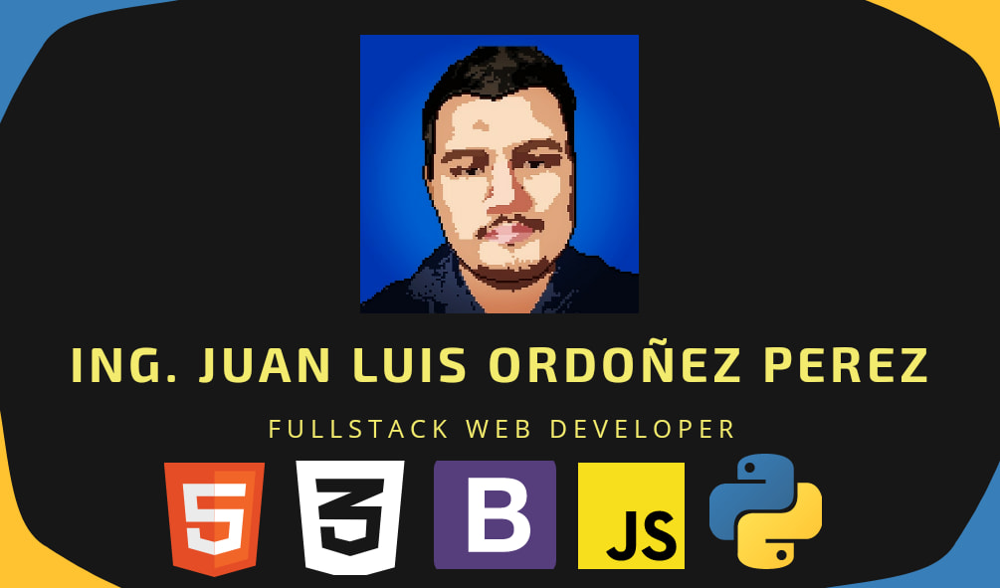

 

# Hi there 👋 

Welcome to my github profile! 🥳

I'm a Fullstack web developer from   Mexico, passionate about learning and teaching.

## ⚡️Skills
✓  HTML5  
✓  CSS3  
✓  Javascript  
✓  Bootstrap 4  
✓  PHP  
✓  Python  
✓  Mysql  
✓  Github  

## 📚Studying
→  Flutter  
→  Dart  

## 🖤 I really enjoy
💻🖥 write code  
 👨‍🏫 Teach  
🗣 be an speaker  

## Contact me at:
→  <a target="_blank" href="https://t.me/ElIngeJuan" >TELEGRAM</a>   
→  <a target="_blank" href="https://wa.me/message/WNRJRXFCQP6DB1" >WHATSAPP</a>  
→  <a target="_blank" href="https://solucioninformaticaexpresstapachula.negocio.site/" >WEB SITE</a>   

  

<h3 align="left">Connect with me:</h3>

&nbsp;

